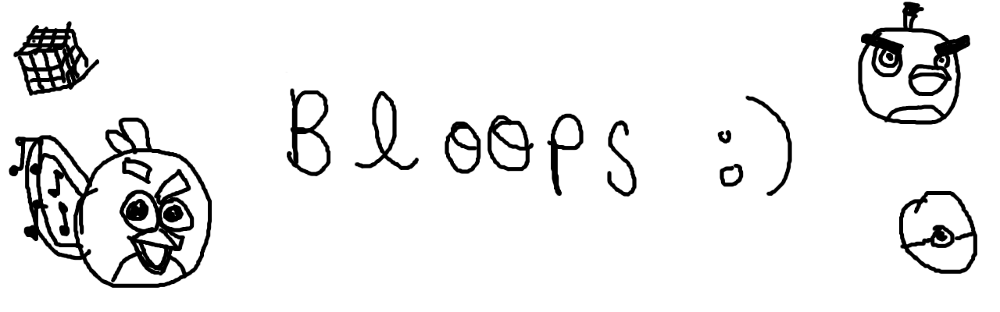

<div align="center">
    
</div>

<hr>

Bloops is an AoPS-like **BBCode to HTML transpiler**
written in Python, with **live-preview**
and support for **Asymptote geometry diagrams**.

<div align="center">
    add badges here
</div>

## Index

- [Features](#features)
- [Requirements](#requirements)
- [Installation](#installation)
- [Usage](#usage)
  - [Options & Flags](#options--flags)
  - [Directory Structure](#directory-structure)
  - [Syntax Guide](#syntax-guide)
- [API Reference](#api-reference)
- [FAQs](#faqs)
- [Contribution](#contribution)
- [TODOs](#todos)

## Features

- **AoPS-Inspired Syntax**: Transpiles mathematical environments
(`[theorem]`, `[lemma]`, `[example]`, `[soln]`), code blocks,
lists, quotes, and formatted text directly into clean and
SEO-friendly HTML.
- **Asymptote Integration**: Automatically extracts, caches, and
compiles `[asy]` blocks into SVG vector graphics using Asymptote.
- **Live Preview and Server**: Built in real-time preview web-server
powered by `livereload` and `watchdog` to preview changes instantly
into the browser.
- **Math & Syntax Highlighthing**: Pre-configured with **MathJax v4**
for TeX rendering and **Highlight.js** (Tokyo Night Dark) for
code syntax highlighting.

## Requirements

- **Python >= 3.10**
- **Asymptote** (`asy` executable available in your system `PATH`)
for vector diagram rendering

## Installation

<!-- TODO: add pypi listing link here -->
<!-- TODO: add AUR entry for bloops -->
Install `bloops` from PyPI. Here is the PyPI listing.

- I suggest using `uv`: run ```uv tool install bloops```.
- Or, if you want to use `pip`: run `pip install bloops`.
- AUR entry is yet to be added.

## Usage

`bloops` is executed via the CLI module syntax.

### Options & Flags

| Flag | Long Flag      | Description                                                               |
| ---- | -------------- | ------------------------------------------------------------------------- |
| `-h` | `--help`       | Show help message for usage of `bloops`.                                  |
| `-v` | `--version`    | Show the version of `bloops`.                                             |
| `-c` | `--build-cont` | Watch `content.bbcode` for changes and continuously rebuild `index.html`. |
| `-p` | `--preview`    | Launch a local web live-server to preview `index.html`.                   |
| `-i` | `--input`      | (**Required**) Input directory containing `content.bbcode`.               |
| `-o` | `--output`     | Output directory for generated assets (defaults to `in_dir/static/`).     |

> [!TIP]
> The most useful way to use `bloops` is to simultaneously
> run a live-preview alongside continuous compilation: to do this, use the `-pc` flag
> while calling `bloops`.

<details><summary>Help Summary</summary>

```bash
usage: bloops [-h] [-v] [-c] [-p] -i INDIR [-o OUTDIR]

An AoPS-like BBCode to HTML transpiler written in Python, featuring live-preview support and dynamic Asymptote geometry diagram compilation.

options:
  -h, --help           show this help message and exit
  -v, --version        show program's version number and exit
  -c, --build-cont     convert BBCode to HTML and continuously write to index.html on change
  -p, --preview        run a preview of index.html on the web-browser
  -i, --input INDIR    directory path which contains the BBCode file
  -o, --output OUTDIR  optional directory path where generated Asymptote diagrams are to be saved
```

</details>

## Directory Structure

```bash
my_document/
├── content.bbcode      # Your source BBCode document
├── index.html          # Generated HTML page
├── build/              # Asymptote build cache and temporary .asy files
└── static/
    ├── style.css       # Stylesheet for rendered document
    └── diagram1.svg    # Compiled Asymptote vector diagrams
```

## Syntax Guide

Bloops uses BBCode syntax inspired by [AoPS](https://artofproblemsolving.com/).
Here are reference tables for each BBCode tag bloops uses:

<details><summary>[asy]</summary>

| Option    | Mandatory | Description                                                                   |
| --------- | :-------: | ----------------------------------------------------------------------------- |
| `src`     |    YES    | Path to the saved image (relative to `content.bbcode`).                       |
| `label`   |    YES    | Label of the diagram which will be used as the filename (**must be unique**). |
| `width`   |     -     | Width in percentage (without % symbol) relative to the body width.            |
| `alt`     |     -     | Alternate text to be shown if the image fails to load.                        |
| `caption` |     -     | Caption for the diagram.                                                      |

</details>

<details><summary>[code]</summary>

| Option | Mandatory | Description                                                                                 |
| ------ | :-------: | ------------------------------------------------------------------------------------------- |
| `lang` |     -     | Language used in the code block (tries to detect the language if argument is not provided). |

</details>

<details><summary>[color]</summary>

| Option  | Mandatory | Description                              |
| ------- | :-------: | ---------------------------------------- |
| `color` |    YES    | Color code in hex (with the leading \#). |

</details>

<details><summary>[img]</summary>

| Option    | Mandatory | Description                                                        |
| --------- | :-------: | ------------------------------------------------------------------ |
| `src`     |    YES    | Path to the saved image (relative to `content.bbcode`).            |
| `width`   |     -     | Width in percentage (without % symbol) relative to the body width. |
| `alt`     |     -     | Alternate text to be shown if the image fails to load.             |
| `caption` |     -     | Caption for the image.                                             |

</details>

<details><summary>[url]</summary>

| Option   | Mandatory | Description                                                            |
| -------- | :-------: | ---------------------------------------------------------------------- |
| `link`   |    YES    | URL link.                                                              |
| `target` |     -     | Target for opening the URL: \[`self`, `blank`\] (defaults to `blank`). |

> `self`: opens the URL in the current page.
>
> `blank`: opens the URL in a new page.

</details>

<details><summary>[list]</summary>

| Option  | Mandatory | Description                                          |
| ------- | :-------: | ---------------------------------------------------- |
| `type`  |     -     | Type of the list: \[`ul`, `ol`\] (defaults to `ul`). |
| `style` |     -     | Style of the list marker.                            |

> Google “list styles in css” for valid styles.

</details>

<details><summary>[quote]</summary>

| Option   | Mandatory | Description                                                                 |
| -------- | :-------: | --------------------------------------------------------------------------- |
| `author` |     -     | Name of the author.                                                         |
| `link`   |     -     | Link to the quote for citation (will not be visible in page, used for SEO). |

</details>

<details><summary>math environments</summary>

Currently, the following math box tags are supported:
`[theorem]`, `[lemma]`, `[proposition]`, `[corollary]`,
`[example]`, `[claim]`, `[problem]`, and `[exercise]`.

There is only one option for each math box: `title`.

| Option  | Mandatory | Description                                                                   |
| ------- | :-------: | ----------------------------------------------------------------------------- |
| `title` |     -     | An optional title for math boxes to be put within parentheses in the heading. |

Apart from these, bloops also provides `[proof]` and `[soln]` for
proof and solutions.

</details>

<details><summary>tags without any options</summary>

| Tag     | HTML Counterpart |
| ------- | ---------------- |
| `[b]`   | `<strong>`       |
| `[i]`   | `<em>`           |
| `[u]`   | `<u>`            |
| `[s]`   | `<s>`            |
| `[*]`   | `<li>`           |
| `[sub]` | `<sub>`          |
| `[sup]` | `<sup>`          |
| `[h1]`  | `<h1>`           |
| `[h2]`  | `<h2>`           |
| `[h3]`  | `<h3>`           |
| `[h4]`  | `<h4>`           |
| `[h5]`  | `<h5>`           |
| `[h6]`  | `<h6>`           |

</details>

<br>

An example showcasing the use of tags mentioned above has been
provided in [example/content.bbcode](example/content.bbcode)
and the corresponding generated HTML file is present in
[example/index.html](example/index.html).

## API Reference

Bloops provides the following public modules and functions:

| Module      | Functions                                                                   |
| ----------- | --------------------------------------------------------------------------- |
| `validator` | `validate_bbcode` & `compile_asy_diagrams`                                  |
| `bloopser`  | `convert_bbcode_to_html`                                                    |
| `bracer`    | `gobble_inside_delim`, `gobble_around_delim`, & `get_close_delim_end_index` |

If you want to convert a BBCode text into HTML using `bloops`,
first run `validate_bbcode`, then `compile_asy_diagrams`, and
finally `convert_bbcode_to_html` on the text.

Bloops also provides the global constants under the `vars` module
which provides `BBCODE_TAGS`, `STYLESHEET`, and `ERROR_TEMPLATE`.

A detailed documentation of these API endpoints can be found in
[docs/API.md](docs/API.md).

## FAQs

**Q: Why are my images not loading even though the src path is valid?**
<details><summary>Answer.</summary>

Make sure that the image can be reached without leaving
the directory in which `index.html` and `content.bbcode` reside.
The suggested place for images to reside is at `static/` as shown
in the example under [Directory Structure](#directory-structure).
In general, the image should be reachable starting from
`my_document/`, as in the example.

> This is due to a caveat of `python-livereload`.
> The directories that are being used to serve static files need to be
> registered before the server is launched. Hence, it is not
> possible to add random directories dynamically into the live-server.

</details>

<br>

**Q: How do I use my own stylesheet?**
<details><summary>Answer.</summary>

Bloops creates a stylesheet at `static/style.css` given that the file doesn't
already exist; otherwise, it does nothing.
So, there are two ways you could use a custom stylesheet:

- Create/Edit the stylesheet at `static/style.css` and put your
  custom style in it.
- Import a style sheet into `static/style.css` by adding
  `@import url("<path-to-your-stylesheet>")` to `static/style.css`.

</details>

<br>

**Q: How do I use my own javascript code?**
<details><summary>Answer.</summary>

I haven't added this feature yet, just open an issue and I'll add it.
The reason for not having added it yet is because I hate JS and you don't
need JS for running simple static pages.
</details>

## Contribution

Contributions are very welcome!
Please read [CONTRIBUTING.md](CONTRIBUTING.md) for a guide on
how to contribute. I'm against the idea of using AI
for writing hobby projects; however, I have no
problem if someone else uses them. If you're using AI assistance
for contributing, please mention so in your PR.
(No AI has been used in this project except for generating docstrings
and the TokyoNight-Night based CSS stylesheet.)

The fourth TODO is a good first issue that you could work on.
Open an issue mentioning this and I'll guide you out on
how to implement it.

## TODOs

- [ ] Implement a post-processor which adds paragraph tags around
every disjoint block of HTML code.
- [ ] Change `BBCODE_TAGS` to a dict instead of a list.
- [ ] Handle `]` inside arguments of BBCode tags.
- [ ] Add script placeholder to HTML templates.
- [ ] De-couple templates and stylesheets by moving them
to their independent files.

<p align="right"><a href="#index">&uarr; Back to top</a></p>
